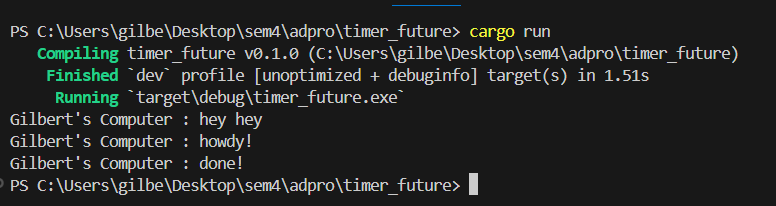

# Gilbert Kristian - 2306274951 - Adpro A

## Reflection Notes
## Understanding How It Works

Screenshot : 

In asynchronous programming, instructions are not executed sequentially. In this case, the `main()` function first creates an executor and a spawner, then calls spawn on the spawner to initiate an asynchronous task. Once the spawn is called, the instruction to execute the task hasn't been given yet, so the task isn't executed immediately. Afterward, `main()` prints "Spawner has been called, task will run asynchronously.", indicating that the task has been queued but not yet processed. Then, `main()` prints "hey hey" first. Only at the end, when the executor is run, does it pick up the spawned task, which then prints "howdy!" after waiting for two seconds, followed by "done!". This order of execution occurs because the asynchronous task is handled by the executor, while the instructions in `main()` are executed first.